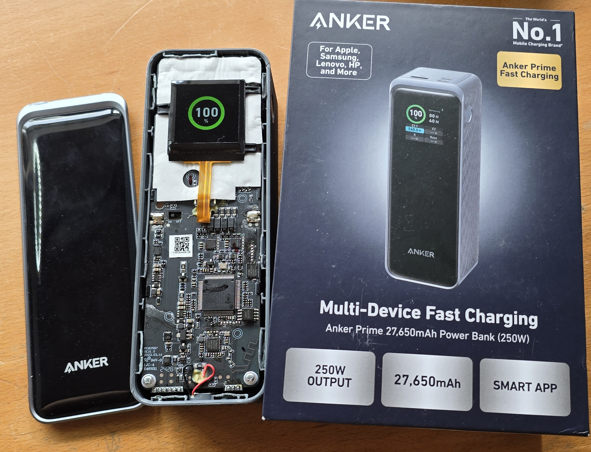
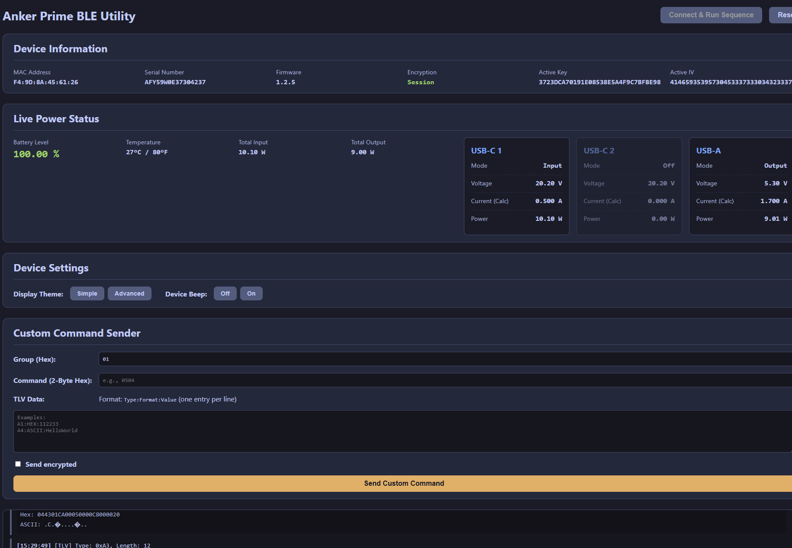
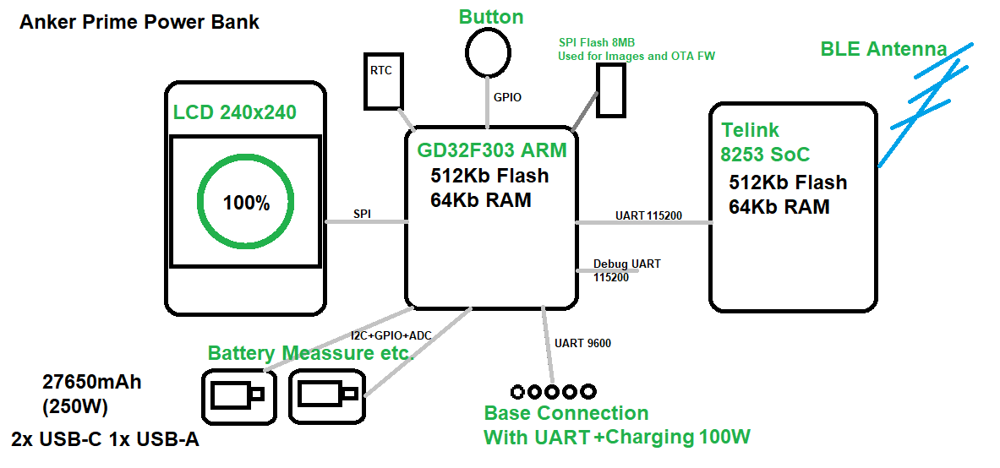
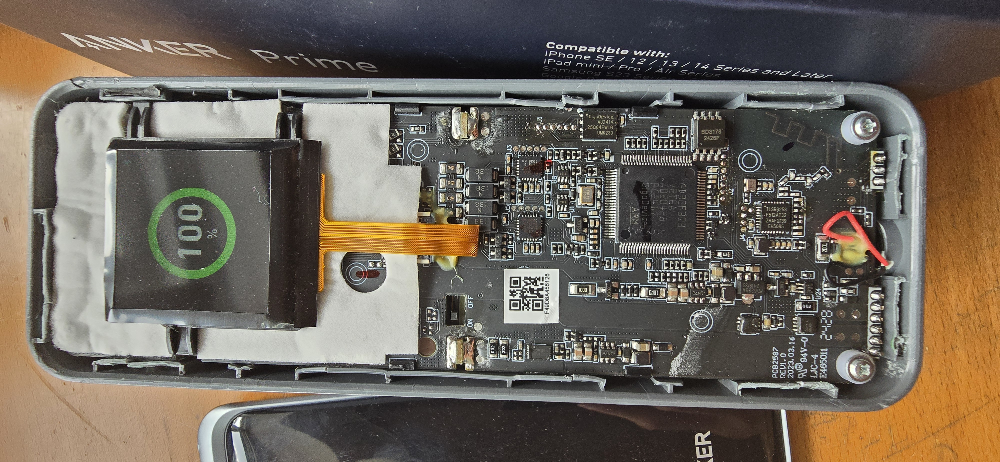
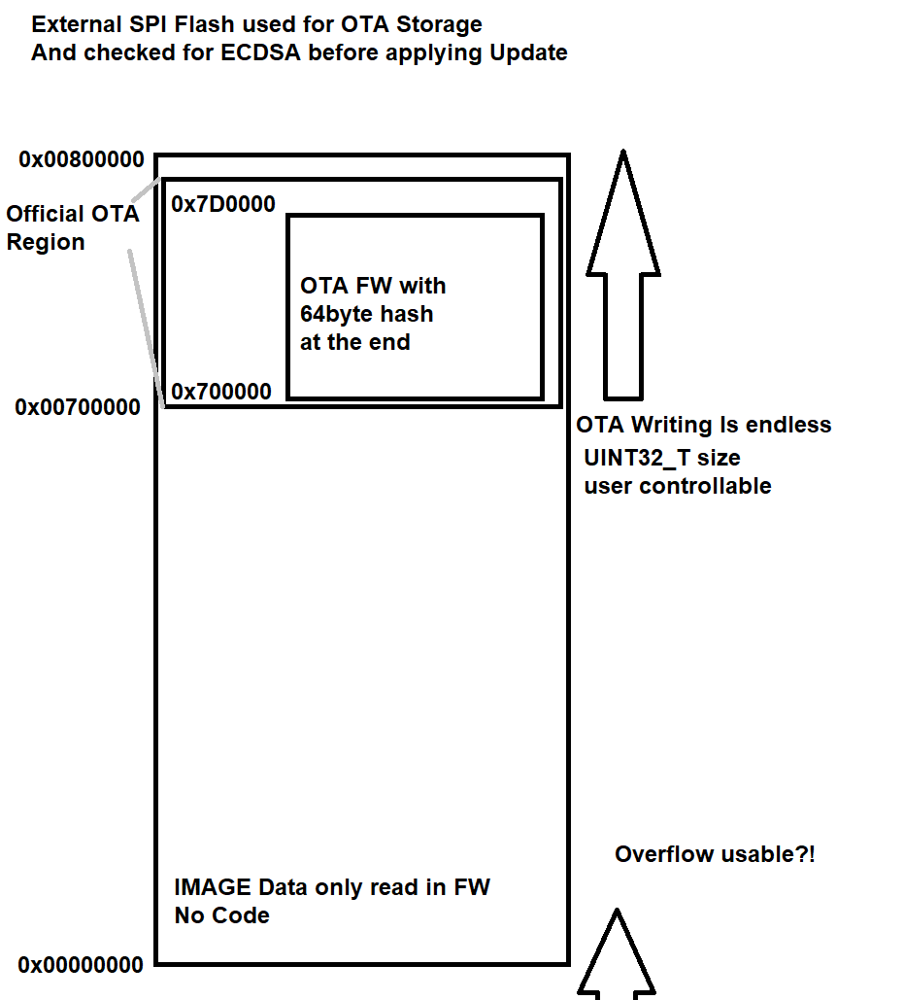
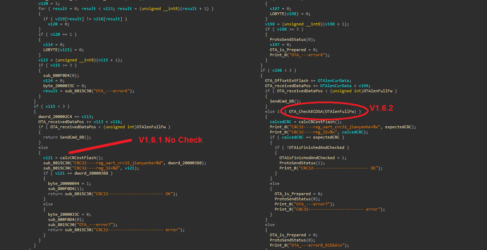
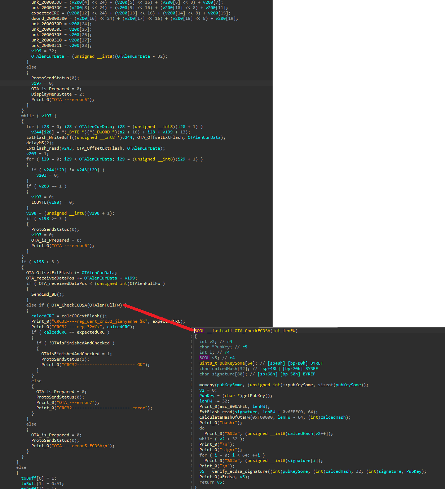

# Anker Prime 27650mAh BLE hacking
Overview of the BLE Enabled Anker Prime 27650mAh Power Bank

Since Anker does only allow the BLE connection to the Power Bank via their App and only via a valid user we ended up here^^

This Repos just puts together a few infos about the Anker Prime Power bank 27650mAh which feature BLE

The BLE Connection is done in an encrypted way but uses a fixed key exchanged based on the Serial Number as well as the Anker Account ID. Funny enough the Master(App) does define the Encryption way and also allows to use no encryption at all which means anyone can connect to your Power bank(and up to Fw 1.6.1 also upload a malicious firmware update)

# WebTool

You can find an WebBluetooth Tool here which lets you connect to your Power bank to read some basic infos vie BLE.

This tool has just the basic functions and is more of a POC, why does a Power Bank need Bluetooth anyway...

[https://atc1441.github.io/AnkerPrimeWebBle.html](https://atc1441.github.io/AnkerPrimeWebBle.html) (Or Click on the image)

From Firmware version 1.6.2 The OTA Update is Signed and checked with an Public key so no altered firmware can be uploaded expect an exploit.

# Firmware Backups

You can find the firmware files for both the GD32F303 as well as the TLSR8253 [here](Firmware_Files)

# Hardware Infos

The Case is pretty much closed and can not be opened without damaging the plastic.

Main SoC: GD32F303 ARM 512KB Flash 64KB RAM

BLE SoC: Telink TLSR8253 TC32 512KB Flash 64KB RAM

LCD ST7789 Based 240x240

27650mAh LiPo Batteries

# Possible GD32F303 OTA Exploit

The firmware upload uses a uint32_t variable to define the size of firmware and so far it looks unchecked.

This will be used to write to the external flash and to check the firmware signature etc.

Since the external flash is 0x8000000(8MB) In size it would loop around this memory region and would allow to write to a region twice, since the LCD Images are stored on the lower area of memory at least these could be overwritten (Bits only from 1 to 0 as this region will not be erased before writing to it) and would "damage" the Power bank as there is no function to upload new images.
 

## Firmware checking the ECDSA Signature

 
